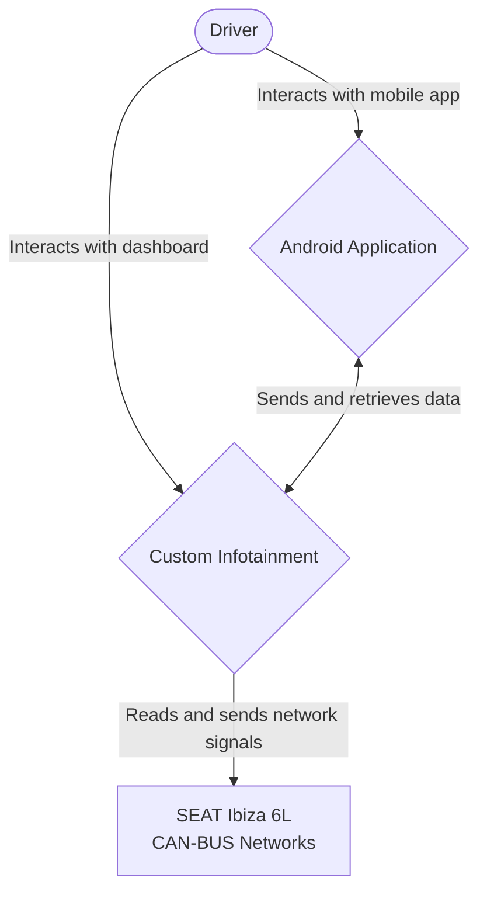

# VAG CAN Infotainment Project

A full-stack automotive project that transforms a **SEAT Ibiza 6L** into a smart car using custom hardware and software. The system reads real-time vehicle data via CAN Bus, displays it on a custom digital dashboard, integrates Android Auto navigation, and enables **keyless entry** and **remote control** over Bluetooth and GSM.

> Built from scratch — from reverse engineering the CAN Bus protocol to designing the PCB-level hardware integration and writing firmware, backend, dashboard, and mobile app.

## What It Does?

| Feature | Description |
|---|---|
| **Live Dashboard** | Real-time RPM, speed, coolant temperature, and fuel level displayed on a 7" touchscreen |
| **Android Auto** | Google Maps, Waze, Spotify, and calls via HUDIY on the same display |
| **Keyless Entry** | Touch a sensor on the window → ESP32 wakes up → scans for the driver's phone via BLE → locks/unlocks the car |
| **Remote Lock/Unlock** | Send an SMS from the app → SIM800L receives it → ESP32 sends CAN command → doors lock/unlock |
| **Telemetry Reports** | Trip history, fuel consumption averages, and engine temperature logs synced to the mobile app |

## System Architecture

The system is split across two controllers, each connected to a separate CAN Bus network:

### Level 1: System Context



| Controller | Network | Role | Stack |
|---|---|---|---|
| **Raspberry Pi 4** (4GB) | Powertrain CAN (500 kbps) | Reads engine data, runs dashboard & Android Auto | Python, SocketCAN, HUDIY, HTML/CSS/JS |
| **ESP32** | Comfort CAN (100 kbps) | Controls locks, lights, windows. Handles BLE & GSM | C++ |
| **Android App** | — | Remote control & telemetry reports | Dart, Flutter |

> See [Architecture Docs](docs/architecture.md) for full C4 diagrams (Container & Component levels)
>
> See [Sequence Diagrams](docs/sequences.md) for detailed interaction flows

## Hardware

| Component | Role | Interface |
|---|---|---|
| Raspberry Pi 4 (4GB) | Dashboard computer + Android Auto | HDMI (7" touchscreen) |
| ESP32 DevKit | Comfort CAN controller + BLE + GSM bridge | GPIO, UART, SPI |
| MCP2515 + TJA1050 | CAN transceiver for Pi (Powertrain) | SPI, 5V |
| SN65HVD230 | CAN transceiver for ESP32 (Comfort) | GPIO, 3.3V |
| SIM800L | GSM/GPRS module for SMS remote control | UART |
| TTP223 | Capacitive touch sensor for keyless entry | GPIO (wake from deep sleep) |
| 7" Touchscreen | Dashboard display | HDMI + USB touch |

## Key Technical Challenges

- **CAN Bus Reverse Engineering** — Decoded proprietary VAG CAN signals (Siemens Simos 3PE ECU) using differential analysis with SavvyCAN and `can-utils` → [CAN Bus RE Notes](docs/can-bus-reverse-eng.md)
- **Dual-Network Architecture** — Designed a system where two independent controllers operate on separate CAN networks without interference
- **Keyless Entry Security** — BLE device authentication with MAC address whitelisting and wake-on-touch via deep sleep GPIO interrupt
- **60fps Dashboard on Pi 4** — GPU-accelerated CSS transitions for smooth gauge animations despite limited hardware

## Project Structure

```
ibiza-smart-car/
├── esp32-firmware/          # C++ — CAN control, BLE, GSM (FreeRTOS)
├── pi-backend/              # Python — CAN reader, telemetry API (SocketCAN)
├── pi-dashboard/            # HTML/CSS/JS — HUDIY widgets, gauges
├── mobile-app/              # Dart — Flutter app (BLE + SMS)
├── dbc/                     # DBC files — decoded CAN signal database
├── docs/
│   ├── architecture.md      # C4 diagrams (Level 2 & 3)
│   ├── sequences.md         # Sequence diagrams (keyless entry, remote lock, etc.)
│   ├── decisions.md         # Architecture Decision Records (ADRs)
│   └── can-bus-reverse-eng.md  # Reverse engineering methodology & findings
└── README.md                # You are here
```

## Tech Stack

| Layer | Technology |
|---|---|
| **Firmware** | C++, ESP-IDF, FreeRTOS, TWAI (CAN) |
| **Backend** | Python 3, python-can, SocketCAN |
| **Dashboard** | HTML5, CSS3, JavaScript, HUDIY |
| **Mobile App** | Dart, Flutter, flutter_blue_plus |
| **Protocols** | CAN 2.0B, BLE 4.2, GSM (AT commands), SPI, UART |
| **Tools** | SavvyCAN, can-utils, Arduino IDE, Linux SocketCAN |

## Documentation

| Document | Description |
|---|---|
| [Architecture](docs/architecture.md) | C4 Container & Component diagrams |
| [Sequence Diagrams](docs/sequences.md) | Interaction flows for all key features |
| [Architecture Decisions](docs/decisions.md) | ADRs explaining why each technology was chosen |
| [CAN Bus Reverse Engineering](docs/can-bus-reverse-eng.md) | Methodology, captured signals, and DBC files |

## License

This project is for educational and personal use. Not intended for production vehicles.

> ⚠️ **Disclaimer:** Interfacing with a vehicle's CAN Bus can affect safety-critical systems. This project was developed and tested on a simulation bench before any vehicle integration. Use at your own risk.
