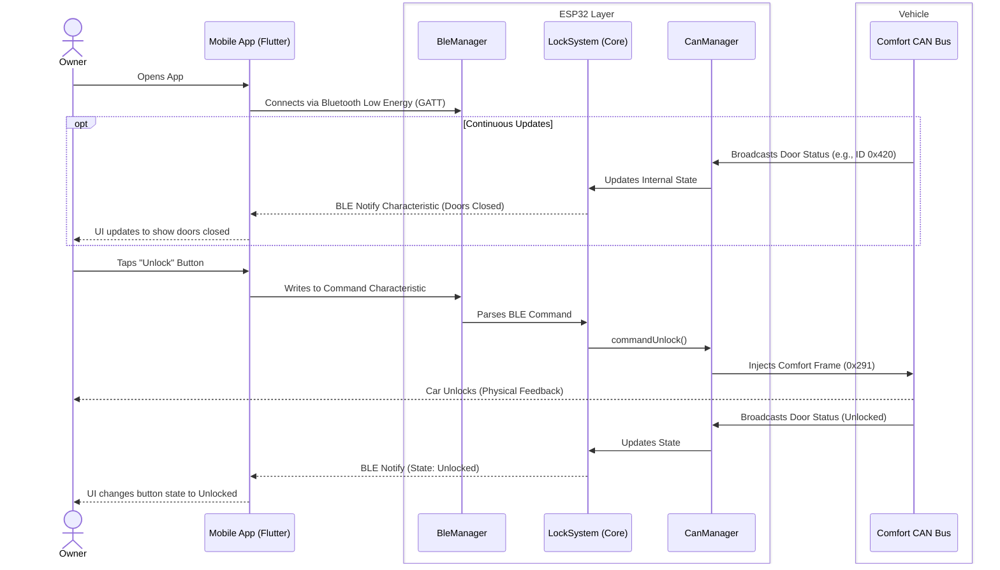

# Mobile App & Comfort Control
*Covers Features: CC01 to CC08, M01 to M08*

This sequence diagram illustrates how the Android app interacts with the ESP32 to send commands and receive live updates about the vehicle's state (e.g., doors open/closed).

