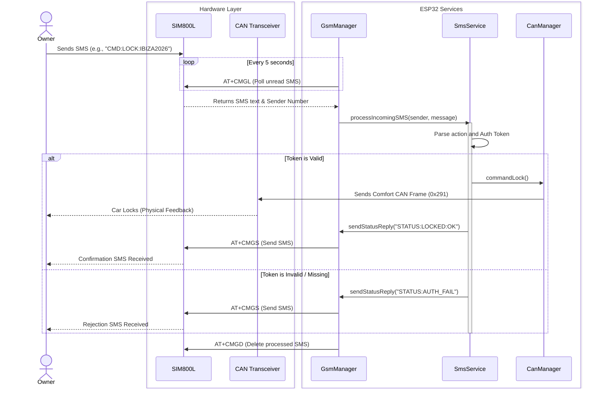

# Remote Control via SMS (GSM)
*Covers Features: RC01 to RC05*

This sequence diagram illustrates how SMS commands are received, parsed, authenticated, and executed by the ESP32.

```mermaid
sequenceDiagram
    actor Owner
    
    box Hardware Layer
    participant SIM as SIM800L
    participant CAN_HW as CAN Transceiver
    end
    
    box ESP32 Services
    participant GSM as GsmManager
    participant SMS as SmsService
    participant CAN_Srv as CanManager
    end
    
    Owner->>SIM: Sends SMS (e.g., "CMD:LOCK:IBIZA2026")
    
    loop Every 5 seconds
        GSM->>SIM: AT+CMGL (Poll unread SMS)
    end
    
    SIM-->>GSM: Returns SMS text & Sender Number
    GSM->>SMS: processIncomingSMS(sender, message)
    
    activate SMS
    SMS->>SMS: Parse action and Auth Token
    
    alt Token is Valid
        SMS->>CAN_Srv: commandLock()
        CAN_Srv->>CAN_HW: Sends Comfort CAN Frame (0x291)
        CAN_HW-->>Owner: Car Locks (Physical Feedback)
        
        SMS->>GSM: sendStatusReply("STATUS:LOCKED:OK")
        GSM->>SIM: AT+CMGS (Send SMS)
        SIM-->>Owner: Confirmation SMS Received
        
    else Token is Invalid / Missing
        SMS->>GSM: sendStatusReply("STATUS:AUTH_FAIL")
        GSM->>SIM: AT+CMGS (Send SMS)
        SIM-->>Owner: Rejection SMS Received
    end
    deactivate SMS
    
    GSM->>SIM: AT+CMGD (Delete processed SMS)
```
