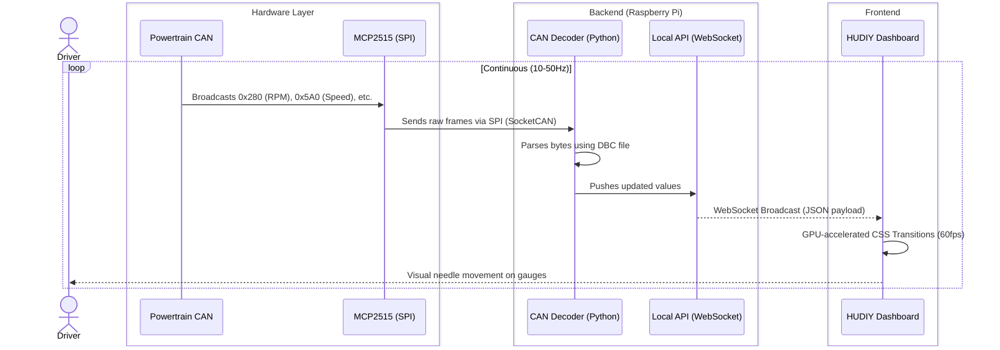

# Telemetry Data Flow (Powertrain CAN)
*Covers Features: Pi01 to Pi09, IB01, IB02*

This sequence diagram illustrates how real-time engine data is read from the vehicle, processed by the Raspberry Pi, and displayed on the dashboard smoothly.

