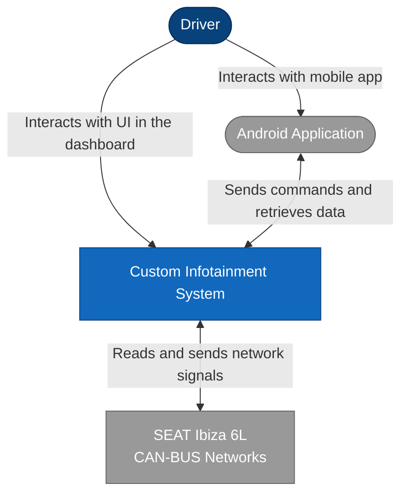
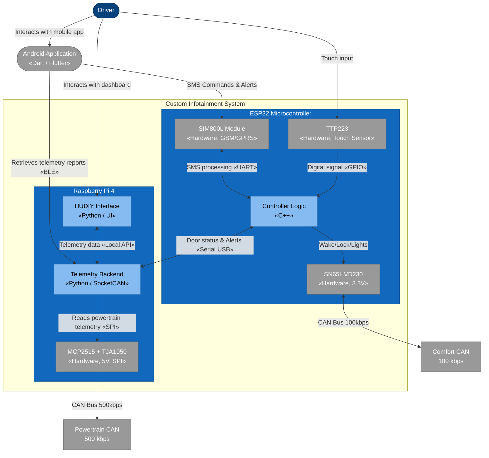
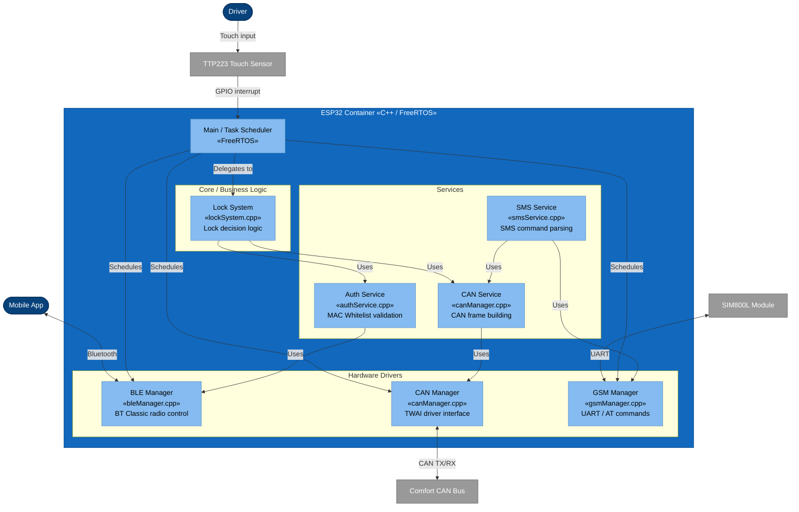
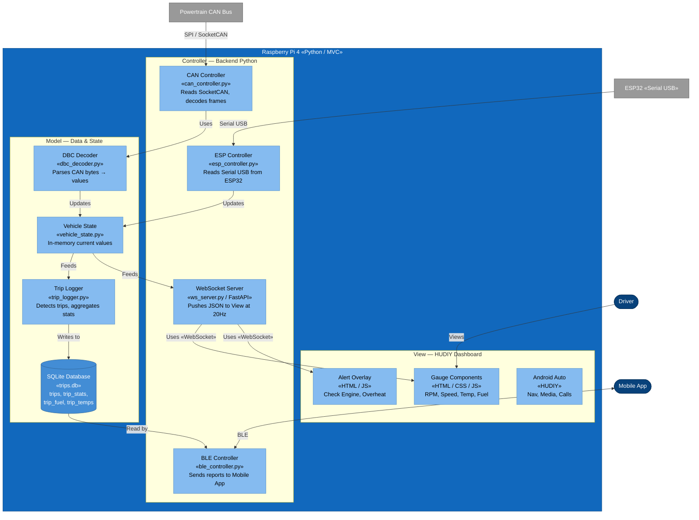

# Architecture (C4 Model)

This document describes the software architecture of the Ibiza Smart Car project using the C4 model. It is broken down into three levels of detail: System Context, Container, and Component.

---

## Level 1: System Context
Shows how the custom infotainment system interacts with the driver, their mobile phone, and the vehicle's existing networks.

---

## Level 2: Container Architecture
Zooms into the Custom Infotainment System to show the main processing units (Raspberry Pi and ESP32) and how they split the workload between the Powertrain and Comfort CAN buses.

---

## Level 3: Component Architecture (ESP32)
Zooms into the ESP32 Microcontroller container to show how the C++ firmware is structured using a layered architecture to separate hardware drivers from business logic.

---

## Level 3: Component Architecture (Raspberry Pi)
Zooms into the Raspberry Pi 4 container to show how the Python backend is structured using the MVC pattern: the **Model** holds vehicle state and trip data (SQLite), the **Controller** reads CAN frames and ESP32 serial data, and the **View** is the HUDIY dashboard rendered in a fullscreen browser.

